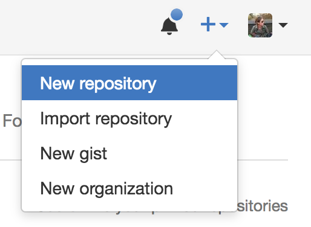
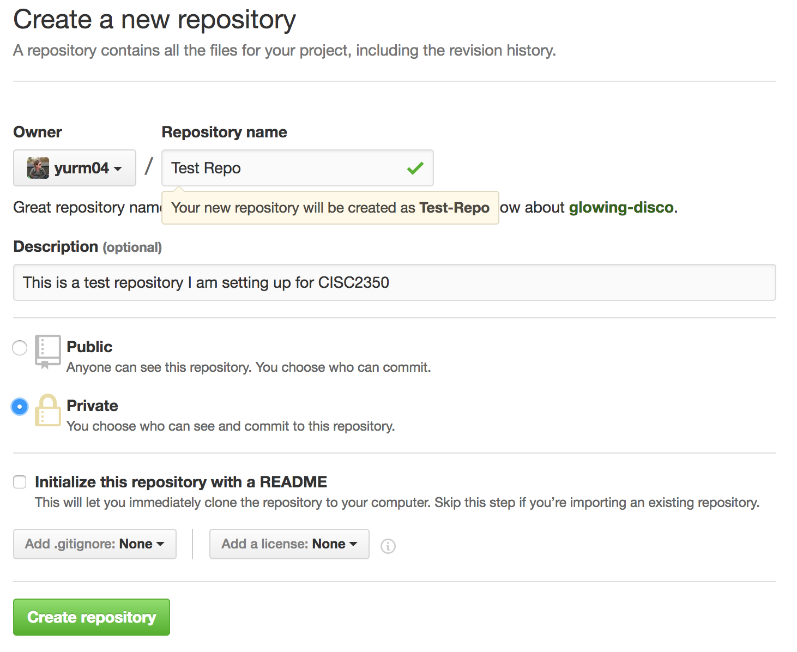
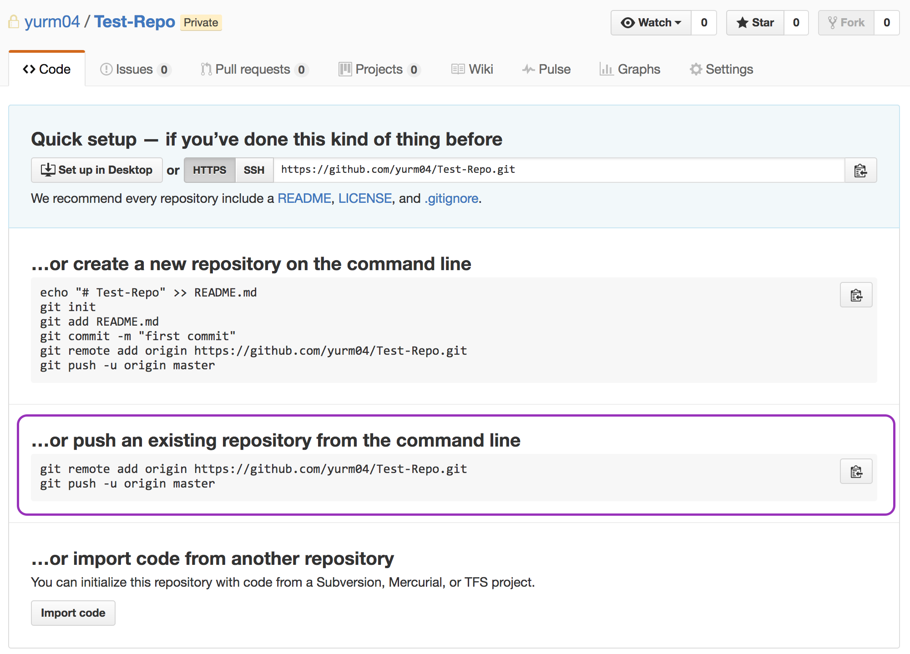

# Information & Web Programming
This repo is meant to be a companion for the Fordham University class CISC 2350 Information & Web Programming. It will be the main source for all assignments, lecture notes, projects, and general class materials.  To get started, please [clone the repo](https://help.github.com/articles/cloning-a-repository/) and follow the instructions below.

## How to use this repo
The CISC 2350 repository should be used as both a resource and a template for individual assignment submissions.  When you clone the repo to your local machine, you will need to create a remote GitHub repository in your own account to keep your own changes synced.  **Please keep your repo copy private, and do not share with other students to remain in compliance with the university academic integrity policy**.

In addition to cloning your own copy of the repository, please [add me as a contributor](https://help.github.com/articles/inviting-collaborators-to-a-personal-repository/) to your private copy using my GitHub username: `yurm04`.

**Going forward, we will refer to your cloned copy of this repository as *your repo*, and this original class repository as the *class repo*.**

## Cloning the class repo to your local machine.
After you have been successfully added as a collaborator to the class repository, you will have access to clone your own local copy.  This will give you your own version of the class repo that you can make changes to, use to submit assignments, and keep in sync with the class repository as the course progresses.

To get set up with a local copy of the class repo via the terminal/command line:

1. From the class repo page, click the green `Clone or download` button to copy the repo URL.  If you do not have SSH keys set up with GitHub (if you aren't sure, you probably do not have them set up), then **make sure you copy the HTTPS url**.
2. Open your terminal/command line and navigate to a directory that you would like to save the repository in.
3. Run the `git clone` command to clone the repo to your local machine.  This will create a `CISC2350` directory and clone the repository locally. **Note** You may be prompted to enter your GitHub username and password if this is the first time using git from the terminal.

  ```
  git clone https://github.com/yurm04/CISC2350.git
  ```
  
4. Once done cloning, navigate to your newly copied `CISC2350` directory.  You can now begin to make changes to your repository locally.

## Updating your local repo with the online class repo
You now have a copy of the class repo on your local machine :+1:  This is your own personal copy that you can make any changes to, without affecting the original class repository.  However, because you cloned this repository from the class original, you also have a remote reference to the class repo in your local repo.  We'll want to make some changes to this remote class reference before we set up your own remote GitHub repo.

### Renaming remote class repo via the command line
1. From your local repo, run the command `git remote -v` to list out all of the remote repos set up with this project.  You should see the following references to the class repository.

  ```
  $  git remote -v
  origin  https://github.com/yurm04/CISC2350.git (fetch)
  origin  https://github.com/yurm04/CISC2350.git (push)
  ```
  
2. Let's rename the current `origin` remote - currently pointing to our class repo - to something that better describes it.  Run the command `git remote rename origin class`.  This will rename the class remote reference from `origin` to `class`.
3. Run the `git remote -v` command again and you should see that the remote class reference was renamed to `class`.

  ```
  $  git remote -v
  class  https://github.com/yurm04/CISC2350.git (fetch)
  class  https://github.com/yurm04/CISC2350.git (push)
  ```

Now that you have renamed the remote class repository, you'll be able reference it more easily when pulling changes from it.

## Creating your GitHub repo
At this point you should have a local copy of the class repository, with a reference to the remote class repository set up.  Now, it is time to create a GitHub repository where you will push your local changes to.

1. Navigate to your GitHub profile.
2. In the top right corner, click on the `+` dropdown and click `New repository`.
  
3. From the `Create a new repository` page, enter your repository name (I suggest `CISC2350`), a short description, and make sure to **set to Private**.  Once this is complete, click the green `Create repository` button.
  
4. When you create the repository, you will see a `Quick setup` page giving you information on how to proceed with pushing your local repository up to your GitHub.
5. From your local repo run the two commands in the `…or push an existing repository from the command line` section (purple box in the image below) of the page.  This will add a reference called `origin` to your repo, allowing you to communicate with your GitHub repo from your local repo.
  
6. Run the `git remote -v` command from your repo to make sure that the `origin` remote reference was added.  You should see an output similar to below.

  ```
  $  git remote -v
  class  https://github.com/yurm04/CISC2350.git (fetch)
  class  https://github.com/yurm04/CISC2350.git (push) 
  origin  https://github.com/YOUR_USERNAME/YOUR_FORK.git (fetch)
  origin  https://github.com/YOUR_USERNAME/YOUR_FORK.git (push)
  ```

You have now created a GitHub repository and set up your local copy to communicate with the remote class repo and your remote repo :tada: At this point, you are ready to **[add me as a collaborator](https://help.github.com/articles/inviting-collaborators-to-a-personal-repository/)** to your GitHub repo.

**Please make sure to stay up to date with changes made to the class repository**.  By running the `git pull class master` command, you will be able to pull down any changes made to the class repo.
