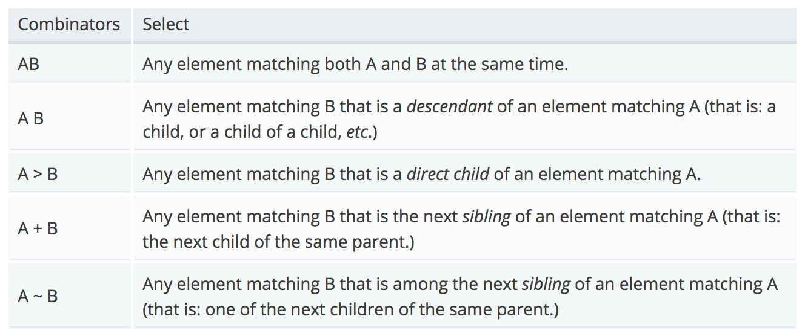

# CSS Selectors

## Cascading Style Sheets
Why do we refer to style sheets as "cascading?"  This refers to a sorting order to determine which style declarations take precedence in a style sheet.

```css
/* style.css */

p {
    color: blue;
}

p {
    color: red;
}


/*
    Which of the two rules will be rendered in our HTML file?
*/
```
One important consideration when determining style precedence is the location of the style declaration.  In general, the location of the style from highest precedence to lowest are as follows:
- Styles included **inline** with the HTML element as a `style` attribute.
- **Internal stylesheets** embedded in the `<style>` element of the HTML `<head>`.
- **External stylesheets** referenced in the HTML file via the `<link>` element.

A good rule of thumb is the closer a style declaration is to the HTML, the higher priority it will take.

## CSS Selectors
We've already seen [a few ways](https://developer.mozilla.org/en-US/docs/Learn/CSS/Introduction_to_CSS/Simple_selectors) to specify a CSS selector:

```css
/* type/element selector */
p {
    color: blue;
}

/* class attribute selector */
.blue-text {
    color: blue;
}

/* id attribute selector */
#blue-par {
    color: blue;
}

/* BONUS: grouping selector */
p,
.blue-text,
#blue-par {
    color: blue;
}
```

Now let's checkout a few other ways we can leverage the ruleset selector using:
- [Nesting/combinators](https://developer.mozilla.org/en-US/docs/Learn/CSS/Introduction_to_CSS/Combinators_and_multiple_selectors)
- [Attribute selectors](https://developer.mozilla.org/en-US/docs/Learn/CSS/Introduction_to_CSS/Attribute_selectors)
- [Psuedo-classes and psuedo-elements](https://developer.mozilla.org/en-US/docs/Learn/CSS/Introduction_to_CSS/Attribute_selectors)

## Combining Selectors
[Combining selectors](https://developer.mozilla.org/en-US/docs/Learn/CSS/Introduction_to_CSS/Combinators_and_multiple_selectors) is one way to achieve a more specific selection on HTML elements.  You have several options available to you when performing selector combinations, through *combinators*



```css
/* style.css */

/* matches <p> elements with the class .body-text */
p.body-text {
	color: blue;
	background-color: red;
}

/* matches <li> elements that are descendents of a <ul> */
ul li {
	color: blue;
	background-color: red;
}

/* matches .message that are direct descendents of .main */
.main > .message {
	color: blue;
	background-color: red;
}

/* matches any <h3> elements that are the next sibling of an <h2> */
h2 + h3 {
	color: orange;
}

/* matches <h5> that are among the next siblings of an <h4> */
h4 ~ h5 {
	width: 100px;
}

```

## Psuedo Classes
A [psuedo class](https://developer.mozilla.org/en-US/docs/Learn/CSS/Introduction_to_CSS/Pseudo-classes_and_pseudo-elements#Pseudo-classes) is a keyword appended to a CSS selector using the `:` character to specify the style of an element *only when it's in a certain state*

```css
a {
	color: black;
	text-decoration: none;
}

/* the :hover psuedo class is active when you mouse over the selected element */
a:hover {
	color: orange;
	text-decoration: underline;
}

```
## Psuedo Elements
A [psuedo element](https://developer.mozilla.org/en-US/docs/Learn/CSS/Introduction_to_CSS/Pseudo-classes_and_pseudo-elements#Pseudo-elements) is similar to a psuedo class, but with one major distinction:

1. Psuedo elements use the `::` characters before their keyword.
2. They select a certain part of the matched element.

```css
/* Adds the right arrow after the element using the ::after psuedo element */
a.next::after {
	content: '»';
}

/* Adds the left arrow before the element using the ::before psuedo element */
a.back::before {
	content: '«';
}
```

---
[« Back - Intro](README.md) | [Next - Units & Dimensions »](2-Units.md)