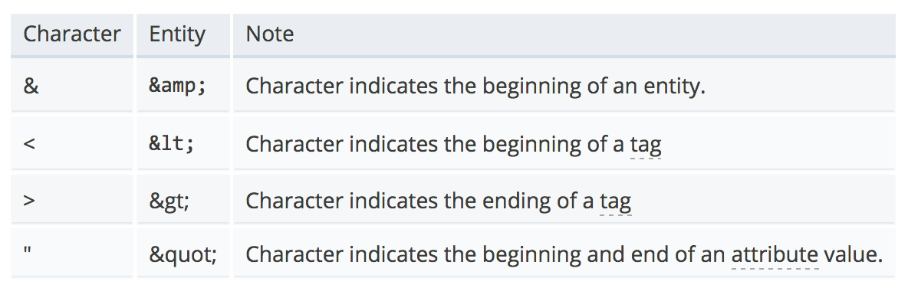

#  Lecture 6
This week we will be discussing some auxilliary topics in HTML, CSS, and web development.

## Browser Compatibility
An important practice in web development is developing sites that can work across multiple browsers among the various operating systems.  Ensuring that your website will function across all or most browsers is a key part of developing a highly accessible product.

When developing for cross browser compatibility, you not only have to consider the type of browser, but also the *version* of the browser, and the operating system the browser is running on.  For example...

| Browser | macOS/OSX | Windows | Linux | iOS | Android |
|---|---|---|---|---|---|
| Chrome | × | × | × | × | × |
| Firefox | × | × | × | × | × |
| Safari | × | | | × | |
| IE | | × | × | | |
| Other | × | × | × | × | × |

**NOTE** When grading your assignments I will be using the latest version of **Chrome**

## Vendor Prefixes
CSS [vendor prefixes](https://developer.mozilla.org/en-US/docs/Glossary/Vendor_Prefix) are strings that are prepended to CSS properties in order to ensure that the property will be rendered in the specified browser (Firefox, Chrome, Safari, IE).  Vendor prefixes specify the *browser rendering engine* that a specific browser is build on top of.

- `-webkit-` (Chrome, Safari, newer versions of Opera.)
- `-moz-` (Firefox)
- `-o-` (Old versions of Opera)
- `-ms-` (Internet Explorer)

There are a couple of reasons to use a vendor prefix along with a regular CSS property:

1. To implement browser specific properties that are not part of the CSS *standard*  e.x. [`::-ms-clear`](https://developer.mozilla.org/en-US/docs/Web/CSS/::-ms-clear)

	```css
	/* microsoft vendor prefix for the clear button in form inputs */
	input::-ms-clear {
		display: none;
	}
	```
2. To use *experimental and non-standard* properties that are supported in a specific browser  e.x. [`-moz-appearance-`](https://developer.mozilla.org/en-US/docs/Web/CSS/-moz-appearance)

	```css
	/* used to give an element a "platform specific" style */
	div {
		-moz-appearance: button;
	}
	```

There a plenty of [lists](http://ireade.github.io/which-vendor-prefix/) available to reference which css properties require vendor prefixes for full browser support and which ones can only be used for specific browsers.

### Helpful Resources
- [bitsofcode blog: CSS Vendor Prefixes](https://bitsofco.de/css-vendor-prefixes/)
- [David Walsh Blog: What are the Vendor Prefixes](https://davidwalsh.name/vendor-prefixes)


## HTML Entities
[An HTML Character Entity](https://developer.mozilla.org/en-US/docs/Glossary/Entity) is used to represent a character in HTML using a specific code.  In general, an HTML element is used to include a *reserved* HTML character in your HTML content.  The reserved HTML characters are:
- `<`
- `>`
- `"`
- `&`

An HTML Entity begins with a `&` and ends with a `;`.  The characters in between the `&` and `'` are the entity *name* or *number* code that map to a specific character.



This example of HTML entities in code...

```html
<p>Information &amp; Web Programming</p>
```

...Will be displayed as

```
Information & Web Programming
```

There is an extensive [list](http://www.freeformatter.com/html-entities.html) of HTML entity character codes and numbers.

## Style Guide
A developer "style guide" is a write up detailing how your code should look.  The purpose of a style guide is to provide specific rules for how code should be structured in order to maintain consistency and readability in projects.

A style guide for any coding project is analogous to the formatting requirements of an essay:

```
Your essay should be in the following format:
- 12pt font
- 1.5pt line spacing
- Each new paragraph indented.
- Page numbers in the bottom right corner
```

Most programming languages have their own basic style guides that are typically followed and recommended.  On top of these base coding guidelines, developers and development teams can define their own specifications.  Coding style guides can create rules on things like...

1. Whitespace
2. Nesting elements
3. Separating code on new lines
4. Tabs vs. Spaces
5. Variable name cases
6. Variable name formats

Lets take a look at the common coding styles for HTML and CSS that we should be following.

###  HTML
- Different elements typically belong on separate lines, unless they are represented as part of the flow of content.
	
```html
<!-- Should be on separate lines -->
<h2>My Subtitle</h2>
<p>My first line of text</p>

<!-- Can be on the same line because of content flow -->
<p>My second line of text with an <a href="">anchor element</a> included
```
___
- Nested elements should be indented once within their parent.

```html
<!-- img element is indented within its parent -->
<div>
	
</div>

<section>
	<p>Line one of text</p>
	<p>Line two of text</p>
	<p>Line three of text</p>
	
	<!-- Further indenting nested elements within a nested element -->
	<ul>
		<li>Bullet 1</li>
		<li>Bullet 2</li>
		<li>Bullet 3</li>
	</ul>
</section>
```
___
- Double quotes for attribute values
	
```html
<a href="http://www.fordham.edu" class="fordham-link">Fordham</a>
```
___
- Use lower case tag names in elements, and lower case attributes.

```html
<!-- NO -->
<H1 CLASS="title">My Title</H1>
<P>Some Text</P>

<!-- Yes, please -->
<h1 class="title">My Title</h1>
<p>Some Text</p>
```


### CSS
- Each declaration is on its own line, unless it is a very small ruleset.
	
	```css
	/* This is fine because it's short */
	h1 { font-size: 16px }

	
	/* This is hard to read */
	p {font-size: 12px;color:#222222;width:240px;height:auto;}

	
	/* Easier to read */
	p {
		font-size: 12px;
		color:#222222;
		width:240px;
		height:auto;
	}
	```
___
- Declarations should be indented within the ruleset braces, braces have a new line after them.
	
	```css
	/* Avoid this */
	p {
	color: black;
	background-color: orange;
	}
	div {
	width: 200px
	background-color: orange;
	}

	/* Much Easier to read */
	.text {
		color: black;
		background-color: orange;
	}
	
	.container {
		width: 200px
		background-color: orange;
	}
	```
___
- Rulesets separated by an empty line

	```css
	/* Causes me physical pain... */
	p {
		color: blue; }
	.container { width: 220px; height: 100px; } section {
		background-color: red;
	} a {
		text-decoration: none;}

	
	/* Clean, consistent, readable */
	p {
		color: blue;
	}

	.container {
		width: 220px;
		height 100px
	}

	section {
		background-color: red; 
		font-family: sans-serif;
	}

	a {
		text-decoration: none;
	}
	```
___
- Class and ID names should be delimiter separated by a `-` for names with multiple words.  Names should also (usually) be all lowercase.
	```css
	/* delimiter separated - use this format */
	.body-text { ... }
	.col-two { ... }
	.lg-heading { ... }

	/* camel case */
	.bodyText { ... }
	.colTwo { ... }
	.lgHeading { ... }
	```

## Developer Tools
Most modern browsers come with a suite of helpful tools that aid web development.  These tools give you insight into your HTML, CSS, JavaScript, and many other technologies.

- [Chrome Developer Tools](https://developer.mozilla.org/en-US/docs/Tools)
- [Firefox Developer Tools](https://developer.mozilla.org/en-US/docs/Tools)

##  Media Queries
A CSS [media query](https://developer.mozilla.org/en-US/docs/Web/CSS/Media_Queries/Using_media_queries) is a directive that allows you to specify the styling for a specific medium, screen size, or device type.  The media query uses logical rules that will correspond to a _condition that must be met_ for the style to apply.

To use a media query, you include the `@media` directive in your style sheet.  this should also include the logical operators, which indicate what conditions need to be met for the styling to apply.  the style rulesets  for the media query should be wrapped in curly braces.

**The general media query format**

```css
@media (logical operators) {

	/* Style rules added here normally */

}
```

**Examples of media queries**

```css
@media only screen {

	/*
		Style rules only apply when
		viewed on a screen
	*/

}


@media only screen and (min-width: 768px) {

	/*
		Style rules only apply when
		viewed on a screen AND screen size
		is at least 768px wide
	*/

}

@media only print {

	/*
		Style rules only apply when in
		print mode
	*/

}

@media (min-width: 320px) and (max-width: 1020px) {

	/*
		Style rules only apply when
		the viewport is at least 320px wide
		and at most 1020px wide
	*/

}
```