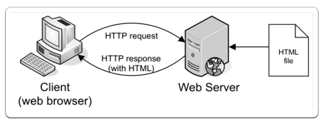
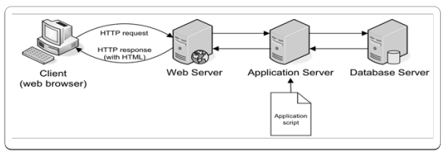

# Server Side Programming
Unitl now, we have been learning about *client side* web development.  The client side, in this case, is the web browser and the technologies that go into it (HTML, CSS, JavaScript).  We are now switching gears to focus on *server side* programming.

## Static vs. Dynamic Web Pages
Server side programming languages (e.x. PHP, .NET, Python, Perl) make creating *dynamic web pages* possible.  Using HTML and CSS we have been creating *static web pages* in this class. Static web pages will always contain *the same content or information* in them no matter what, until you change the source code of the page.  Dynamic web pages are capable of producing *different content* for a web page or web site using the same source code, based on the application logic written by the developer.

Dynamic web pages will often be powered by a server side programming language and a database (e.x. MySQL, SQL Server, Oracle).  Together, these technologies can determine what information should be returned to the browser and costruct dynamic content for the client side to present to the user.

## Request-Response Procedure
The *request-response* procedure explains how you are able to access web sites over the internet.  Below we will go over two simplified versions of this procedure.

When working with regular client side technologies, the request-response cycle is pretty simple.

1. You enter a website address *http://example.com* into the browser's address bar.
2. The browser looks up the address for *http://example.com* and requests the web page associated with it.
3. The request traverses the internet for the server that lives at *http://example.com*
4. The server at *http://example.com* receives the request and sends the  (HTML) web page for *http://example.com*.
5. The browser recieves the web page sent from the server and shows it to the user.

When creating dynamic web pages, this process is slightly more complicated on the server side of the cycle.

1. You enter a website address *http://example.com* into the browser's address bar.
2. The browser looks up the address for *http://example.com* and requests the web page associated with it.
3. The request traverses the internet for the server that lives at *http://example.com*.
4. The server at *http://example.com* receives the request and interprets it as a PHP file.
5. The PHP interpreter executes the PHP code and passes any MySQL statements to the database to be processed.
6. The PHP interpreter and MySQL return the resulting data to the web server as HTML.
7. The web server sends the generated page to the browser, which displays it to the user.

## Resources
*Learning PHP, MySQL, JavaScript & CSS* - Chapter 1

___

[Next - Server Side Requirements »](2-Reqs.md)
-
[« Back - Table of Contents](2-Reqs.md)