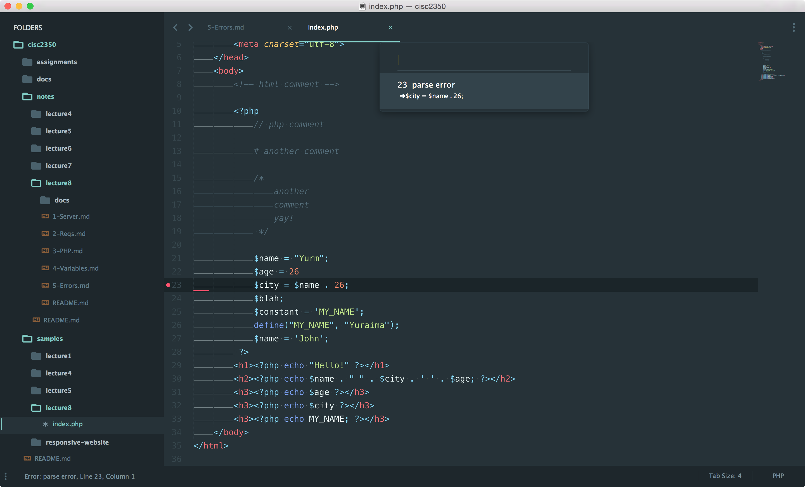

# Resolving Errors
We've already seen what will happen to our website if we have any PHP errors in our code (White screen of :skull:).  Below are a couple of ways to resolve discover and resolve errors when they occur.

## Linters
A text editor linter is a program or package you install in your text editor that can help you catch errors as you code.  As you code in your editor (Atom, Sublime, etc.) if the linter notices that you made an error, it let's you know where and what the error is.  The image below shows my linter telling me that there is a `parse error` on `line 23` of my file (I forgot the semi colon at the end of `line 22`!).  Linters will vary by editor, but they all generally perform the same function.

## Error Logs
MAMP (and any reliable server) will have some kind of error tracking that you can reference when you are tracking down a bug.  These files are called `error logs`, and will contain any error messages, warnings, notices, and debugging that your website produces.  For MAMP, this error log can be found in:

	/Applications/MAMP/logs/php_error.log

Opening it up will show you the errors that have occurred, in the specific file, with a line number, and time stamp.  You can monitor this file while you are coding or debugging in order to track down errors more quickly.

## PHP Configuration
When You install PHP on your computer, it came with its own settings file that are specific to your PHP installation.  This file is called the `php.ini` file and can be modified to meet your development needs.  If you view the `php.ini` file in the default location:

	/Applications/MAMP/bin/php/php7.0.15/conf/php.ini

You will see that there are several options we can tinker with to customize our PHP.  **PLEASE DO NOT MODIFY ANYTHING IN THIS FILE IF I HAVE NOT EXPLICITLY INSTRUCTURED YOU TO**.  One change we can make to this file to make debugging a bit easier is on `line 277` with the setting `display_errors`.  this line item controls whether or not error are displayed in the browser (instead of a white screen).  If we switch it to `display_errors = On`, we will be able to immediately see the error on our page in the browser when they occur.

___

[« Back - Intro to PHP](4-Variables.md)

